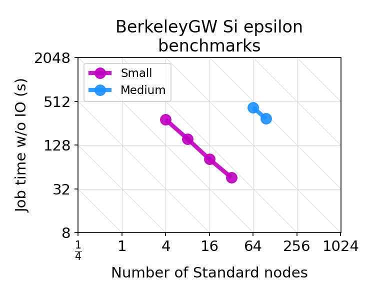
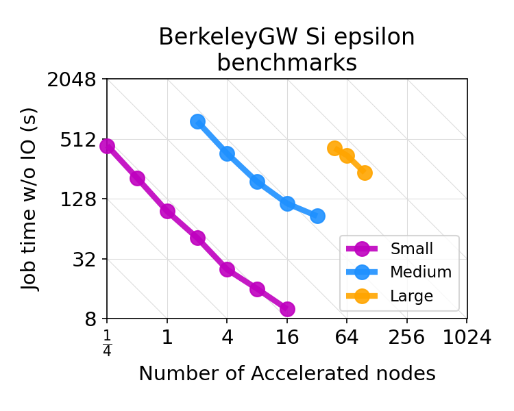

This benchmark for NREL ESIF-HPC4 adapts the Optical Properties of Materials benchmark from the [NERSC-10 Benchmark Suite](https://www.nersc.gov/systems/nersc-10/benchmarks). 

Any available ESIF-HPC4 benchmark run rules should be reviewed before running this benchmark.

Note, in particular:
- Any broader ESIF-HPC4 run rules apply to this benchmark except where explicitly noted within this README.
- Responses to the ESIF-HPC4 RFP including this benchmark must include the performance metrics discussed below in section 3.1. These values include whether the run successfully completed (Validation), the Total Time in seconds, the Total I/O Time in seconds, and the Benchmark Time (defined as Total Time minus Total I/O Time) in seconds. Each timing result must be taken from the "max" column of the "Wall time (s)" right columns (the final time column before "Number of calls") in the BerkeleyGW output file summary table. Each reported result's BerkeleyGW output file must be provided. The reference times included for this benchmark were run by NREL on Kestrel. 
- This benchmark defines multiple problem sizes: small, medium, and large to allow testing across a range of resource sizes. Only the large benchmark is rqeuired for the RFP response, however the offeror might wish to provide additional timing data for the small/medium benchmarks to showcase the offered system's performance at many calculation scales. The multiple problem sizes form a weak-scaling set, and a given problem size can be run with different amounts of compute resources to form a strong-scaling set. We have provided a table with strong-scaling results for each problem size at the end of this document to provide reference data on the performance currently achievable on Kestrel.  
- This benchmark can be run on standard or accelerated compute nodes, and is expected to perform well on both. In general, we see approximately 3x speed-up for the benchmarks when moving from the smallest possible number of standard nodes each size can run on to the smallest possible number of accelerated nodes. These benchmarks should be performed on each type of node offered.

For this BerkeleyGW benchmark, we describe here how different job modifications are classified for Baseline, Ported, and Optimized results. Any change not discussed here is assumed to be addressed by the general ESIF-HPC4 run requirements. For example, FP64 precision must be used for the Baseline and Ported reported results. 

For Baseline results, the offeror may:
1. Modify any optimization flags (the "-O#" flags) in the makefile.
2. Use any libraries (e.g. scalapack vs ELPA as the eigenvalue solver). The environment used to build BerkeleyGW must be provided in the response.
3. The number of OMP_NUM_THREADS used at runtime.
4. The directory striping for file I/O.

For Ported results, the offeror may:
1. Modify the BerkeleyGW offloading directives. BerkeleyGW uses OpenACC and OpenMP-target directives, and which are known to run well on multiple types of accelerated nodes. Other directives may be used if they improve performance. 

For Optimized results, the offeror may:
1. Modify the BerkeleyGW source code in any other way not related to changing the offloading directives. For example, BerkeleyGW runs using FP64 precision and timing results using other precisions may be included as "Optimized" results in the RFP response as long as the job correctness is validated and the changes to the BerkeleyGW source code are documented. 

# 0. Workflow Overview

Predicting optical properties of materials and nanostructures is a key step toward developing future energy conversion materials and electronic devices. The BerkeleyGW code is widely used for this type of simulation workflow. A typical workflow takes some mean field-related quantities from DFT-based codes such as PARATEC, Abinit, PARSEC, Quantum ESPRESSO, OCTOPUS and SIESTA. Then BerkeleyGW's Epsilon module computes the material's dielectric function. The Sigma module uses the output of the preceding steps to compute the electronic self energy. Two other modules, Kernel and Absorption, can build upon the output from Epsilon and Sigma to calculate the electron-hole interactions and neutral optical excitation properties.

This benchmark focuses on the Epsilon stage of the workflow; the DFT, Sigma, Kernel, and Absorbtion stages are not included in this benchmark. 

The BerkeleyGW code is mostly written primarily in Fortran, with some C and C++, and contains about 100,000 lines of code. It is parallelized using MPI and OpenMP on the CPU, and OpenACC/OpenMP-target constructs on GPUs. The project website is https://berkeleygw.org, and its documentation is available from http://manual.berkeleygw.org/4.0/. A paper derscribing the details of its implementation is published here: https://www.sciencedirect.com/science/article/pii/S0010465511003912?via%3Dihub. BerkeleyGW is distributed under the Berkeley Software Distribution (BSD) license. Please see the [license.txt](BerkeleyGW/license.txt) and [Copyright.txt](BerkeleyGW/Copyright.txt) files for more details.

## 0.1 Epsilon 

The Epsilon module for the GPP approach has three main computational kernels:
* MTXEL: Matrix elements computation
* CHI-0: Static Polarizability
* Inversion: Matrix inversion of the static polarizability (LU decomposition + triangular inversion)

For the series of input problems distributed with this benchmark, the computational complexity of Epsilon increases quartically, $O(N^4)$, with the number of atoms.

## 0.2 Parallel decomposition

Epsilon uses a two-tier MPI Inter- and Intra-pool decomposition to exploit the available parallelism. 

# 1. BerkeleyGW Code Access and Compilation Details

The instructions below can be used to build BerkeleyGW for the GPU-accelerated nodes of NREL's Kestrel system. This example is not intended to prescribe how to build BerkeleyGW; some modifications may be needed to build BerkeleyGW for other target architectures. A download of the BerkeleyGW source code will contain a config/ directory containing arch.mk files the offeror might useful for compiling on their machine. 

## 1.0 Build Environment

Before beginning, it is convenient to store the path to directory that contains this README.md file in the E4_BGW variable:

```
E4_BGW=$(pwd)
```

BerkeleyGW depends on multiple external software packages, and has been tested extensively with various configurations. BerkeleyGW might perform better when using optimized math libraries, for example by using ELPA instead of ScaLAPACK for matrix diagonalization. 

| Category | Dependency<br>Level | Tested Packages |
|---       |---                  |---                 |
| Operating system | required   | Linux, AIX, MacOS  |
| Fortran compiler | required   | pgf90, ifort, gfortran, g95, openf90, sunf90, pathf90,<br>crayftn, af90 (Absoft), nagfor, xlf90 (experimental) |
| C compiler       | required   | pgcc, icc,  gcc, opencc, pathcc, craycc, clang   |
| C++ compilers    | required   | pgCC, icpc, g++, openCC, pathCC, crayCC, clang++ |
| FFT              | required   | FFTW versions 3.3.x |
| LAPACK/BLAS      | required   | NetLib, ATLAS, Intel MKL, ACML, Cray LibSci      |
| MPI              | optional   | OpenMPI, MPICH1, MPICH2, MVAPICH2, Intel MPI     |
| ScaLAPACK/BLACS  | required if MPI is used |  NetLib, Cray LibSci, Intel MKL, AMD |
| File IO          | required   | HDF5 |

On Kestrel, these libraries can be loaded by module commands:
```bash
module swap PrgEnv-gnu PrgEnv-nvhpc
module load cray-hdf5-parallel
module load cray-fftw
module load cray-libsci
module load python 
```

## 1.1 Downloading BerkeleyGW

To compile BerkeleyGW yourself, the latest version of BerkeleyGW can be downloaded from the BerkeleyGW website: https://berkeleygw.org/download/. The current release (4.0 at the time of this writing) is recommended for use due to the many performance improvements implemented as compared to the 3.x versions. Enter the E4_BGW directory, then download and untar the BerkeleyGW source code:
```
cd $E4_BGW
wget https://app.box.com/shared/static/22edl07muvhfnd900tnctsjjftbtcqc4.gz
tar -xvf BerkeleyGW-4.0.gz
```

## 1.2 Configuring BerkeleyGW

If you decide to build your own version of BerkeleyGW, the BerkeleyGW build system is based on `make` and requires manual configuration by editing an architecture-specific makefile named `arch.mk`. Example `arch.mk` files for various supercomputers are provided in the `$E4_BGW/BerkeleyGW/config` directory.
* Select the file most closely related to the target environment and copy it. For example:
```bash
cd $E4_BGW/BerkeleyGW
cp config/perlmutter.nersc.gov-nvhpc-openacc.mk arch.mk
```
* Edit the `arch.mk` file to fit your needs, for example, by adding the appropriate library paths.
Refer to the [BerkeleyGW manual](http://manual.berkeleygw.org/4.0/compilation-flags/) for more options.

## 1.3 Compiling BerkeleyGW

Stay in the `BerkeleyGW` directory to compile the various BerkeleyGW modules. (Many modules could optionally be compiled, but this benchmark only uses Epsilon.) The following command will generate the complex (`cplx`) version of the code.
```
cp flavor_cplx.mk flavor.mk
make -j epsilon
```
After compilation, the excutable (`epsilon.cplx.x`) will be in the source directory. Symbolic links with the same name will be in the `BerkeleyGW/bin` directory.

# 2. Running the BerkeleyGW benchmark

The directory contains three problem sizes:

| Problem Size | Atoms             |
| ------------ | ----------------- |
| small        | Si<sub> 214</sub> |
| medium       | Si<sub> 510</sub> |
| large        | Si<sub> 998</sub> |

Each problem simulates a silicon divacancy defect embedded in a series of progressively larger supercells. The small, medium, and large problems are provided to facilitate testing and profiling across a wide range of numbers of resources. 

## 2.1 Download wave-function data

Each problem requires several data files that must be downloaded prior to running the benchmarks. The largest of these are the `.WFN` (wave-function) files. These files are large and are provided separately to avoid accidental download. The workflow for each problem size can be executed using only the corresponding data files. (To run the large benchmark workflow, only the large benchmark files need to be downloaded.)

The data files should be downloaded to the `Si_WFN_folder` directory. Note that it may be possible to reduce I/O time by moving the `Si_WFN_folder` to a high performance filesystem prior to the download and distributing the directory over multiple disks ("striping"). Explicit striping instructions are not provided here because the commands and optimal settings are not transferable to other filesystems.

The files are currently available from the [NERSC BerkeleyGW Benchmark data portal](https://portal.nersc.gov/project/m888/nersc10/benchmark_data/BGW_input) and can be retreived using `wget`. The `wget_WFN.sh` script is provided to simplify the download process:
```
$ cd Si_WFN_folder
$ ./wget_WFN.sh --help
| Usage: wget_WFN.sh <size>
| Allowed sizes: 
|  [ small     (   3 GB ), 
|    medium    (  18 GB ), 
|    large     (  71 GB ) ]
```

## 2.2 Update site-specific files

Enter the `$E4_BGW/benchmark` folder and edit the `site_path_config.sh` script to specify the location of required libraries, BerkeleyGW executable (`bin/`) folder and folders with large I/O files. In particular:
* `HDF_LIBPATH=` path to the location of libraries, if any.
* `BGW_DIR=` path to epsilon.cplx.x (i.e., the `BerkeleyGW/bin` directory created in the previous section).
* `Si_WFN_folder=` path to large I/O downloaded files (`$Si_WFN_folder/` from the previous section).

## 2.3 Submit

Each problem size has its own subdirectory within `$E4_BGW/benchmark`. Each of those directories contains the input files needed for Epsilon, and a submit script suitable for NREL's Kestrel system. For example, to run the large size Epsilon calculation on Kestrel, after having appropriately modified `berkeleygw-workflow/benchmark/site_path_config.sh`, do:
```
cd $E4_BGW/benchmark/large_Si998/
sbatch run_epsilon_Si998.sh 
```

Note that a script called stripe_large has been included that on Kestrel allows striping of a particular directory. This script can optionally be called by each `run_epsilon_XXXX.sh` Slurm script and can be modified if alternative striping is used. The I/O performance of the medium and large benchmarks in particular might benefit from striping the Si wavefunction and run directories across ~24-72 OSTs on Lustre file systems, as the wavefunctions and epsilon matrix files are dozens of GB in size. 

Each Kestrel GPU node has 4 NVIDIA H100 GPUs and dual socket AMD Genoa CPUs. The parallel configuration for all runs on Kestrel used 4 MPI tasks per node, and each MPI task uses 1 GPU and 16 CPU cores. To run on systems different than Kestrel, modify the run scripts to reflect the hardware specifics of the architecture of interest. For Epsilon, there are no constraints on the number of MPI tasks that may be used. The input file (`epsion.inp`) may not be modified **except** to optimize the maximum GPU memory per MPI rank (in GB) to use for Epsilon's chi summation phase using the `max_mem_nv_block_algo` flag in `epsion.inp`. This flag can have a strong influence on time to solution: more memory typically improves performance. Half the device memory is a reasonable initial guess.

The `run_epsilon_XXXX.sh` scripts will generate the `BGW_EPSILON_$SLURM_JOBID` folder where the calculations will run, and all output files will be written to this directory. The `$SLURM_JOB_ID` variable will be defined by SLURM when the job is submitted. The main results, including timing information, are directed to standard output, which will be directed to `BGW_EPSILON_$SLURM_JOBID.out`.

# 3. Results

The run scripts in the benchmark directories will write standard output to `BGW_EPSILON_$SLURM_JOBID.out`, with `$SLURM_JOBID` being the job id assigned to your job by Slurm at submission. Each stdout file contains the information needed to determine the programs' correctness and performance for the Epsilon benchmark. 

## 3.1 Correctness & Timing

Correctness can be verified using the `benchmark/BGW_validate.sh` script, which compares values from the output to their expected output. The result of the validation test is printed on the first line of the script output. For example:
```
$ ../BGW_validate.sh: test output correctness for the ESIF-HPC4 BerkeleyGW benchmark.
|  Usage: BGW_validate.sh <app> <size> <output_file>
|  Allowed apps: [ epsilon ]
|  Allowed sizes: [ small, medium, large ]
|  Example: BGW_validate.sh epsilon small BGW_EPSILON.out

$ ../BGW_validate.sh: epsilon small BGW_EPSILON.out
|  Testing epsilon small
|  Validation:    PASSED
|  Total Time:     62.45
|  I/O Time:        5.33
|  Benchmark Time: 57.12
```
In addition, these scripts will print several performance results for the job:
* Total Time corresponds to the full duration of the executed job.
* I/O Time is the time spent writing data to disk.
* Benchmark Time is computed by subtracting the I/O times from the Total Time.

## 3.2 Performance on Kestrel

The sample data in the table below are measured runtimes from NREL's Kestrel CPU and GPU partitions. We also provide a Python script in visualization/plot-times.py (it reads visualization/results-summary.xlsx) that an Offeror may optionally use to plot their results and compare with NREL's baseline performance results. 

### 3.2.1 Standard (CPU) Node Performance

Kestrel has dual socket Intel Xeon Sapphire Rapids CPU nodes with 52-core processors (104 cores total) and 256 GB memory. The CPU-targeted BerkeleyGW executables were built using PrgEnv-gnu. Note that the number of MPI threads used (as set by OMP_NUM_THREADS) may substantially impact benchmark time-to-solution. The table below summarizes our current best Small and Medium benchmark results for different numbers of Kestrel CPU nodes. We have not run the Large benchmark on Kestrel's CPU nodes. 

| Node Type | Problem Size | CPU or GPU Nodes Used | MPI Tasks | Threads | Epsilon Total Time (seconds) | Epsilon I/O Time (seconds) | Epsilon Benchmark Time (seconds) |
|:---------:|:------------:|:---------------------:|:---------:|:-------:|:----------------------------:|:--------------------------:|:--------------------------------:|
|    CPU    |     Small    |           4           |    416    |    1    |              289             |              2             |                287               |
|    CPU    |     Small    |           8           |    832    |    1    |              157             |              2             |                156               |
|    CPU    |     Small    |           16          |    1664   |    8    |              83              |              2             |                82                |
|    CPU    |     Small    |           32          |    3328   |    8    |              47              |              1             |                46                |
|    CPU    |    Medium    |           64          |    6656   |    8    |              422             |              3             |                420               |
|    CPU    |    Medium    |           96          |    9984   |    8    |              298             |              3             |                296               |



### 3.2.2 Accelerated (GPU) Node Performance

Kestrel's GPU nodes have one dual socket AMD Genoa CPU with 64-core processors (128 cores total) and four NVIDIA H100 SXM GPUs with 80 GB memory. Each GPU node job used four MPI tasks per node, each with one GPU and 16 cores. The GPU-accelerated BerkeleyGW executables were built using PrgEnv-nvhpc. Note that the number of OpenMP threads used (as set by OMP_NUM_THREADS) may substantially impact benchmark time-to-solution. For example, although most GPU benchmarks shown here run roughly optimally on Kestrel using 16 threads, the Large benchmark on 48 GPU nodes ran faster using 24 threads (see [Section 3.2.2.2](#3222-large-benchmark-gpu-performance-with-openmp-threads) below). The table below summarizes our current best Small, Medium, and Large benchmark results for different numbers of Kestrel GPU nodes. 

| Node Type | Problem Size | CPU or GPU Nodes Used | MPI Tasks | Threads | Epsilon Total Time (seconds) | Epsilon I/O Time (seconds) | Epsilon Benchmark Time (seconds) |
|:---------:|:------------:|:---------------------:|:---------:|:-------:|:----------------------------:|:--------------------------:|:--------------------------------:|
|    GPU    |     Small    |          0.25         |     1     |    16   |              455             |             16             |                439               |
|    GPU    |     Small    |          0.5          |     2     |    16   |              228             |             21             |                207               |
|    GPU    |     Small    |           1           |     4     |    16   |              102             |              6             |                96                |
|    GPU    |     Small    |           2           |     8     |    16   |              56              |              3             |                52                |
|    GPU    |     Small    |           4           |     16    |    16   |              27              |              2             |                25                |
|    GPU    |     Small    |           8           |     32    |    16   |              18              |              2             |                16                |
|    GPU    |     Small    |           16          |     64    |    16   |              12              |              2             |                10                |
|    GPU    |    Medium    |           2           |     8     |    16   |              811             |             40             |                771               |
|    GPU    |    Medium    |           4           |     16    |    16   |              392             |             26             |                366               |
|    GPU    |    Medium    |           8           |     32    |    16   |              203             |             13             |                190               |
|    GPU    |    Medium    |           16          |     64    |    16   |              124             |              9             |                115               |
|    GPU    |    Medium    |           32          |    128    |    16   |              96              |             10             |                86                |
|    GPU    |     Large    |           48          |    192    |    24   |              441             |             28             |                414               |
|    GPU    |     Large    |           64          |    256    |    16   |              409             |             60             |                349               |
|    GPU    |     Large    |           96          |    384    |    16   |              296             |             61             |                235               |



#### 3.2.2.1 Medium benchmark Accelerated (GPU) Node Performance with OpenMP Threads

Below we also include timing results comparing the impact of number of OpenMP threads for selected GPU node counts. First, for the Medium benchmark, we find that using 16 MPI threads is approximately optimal across numbers of nodes. 

| Node Type | Problem Size | CPU or GPU Nodes Used | MPI Tasks | Threads | Epsilon Total Time (seconds) | Epsilon I/O Time (seconds) | Epsilon Benchmark Time (seconds) |
|:---------:|:------------:|:---------------------:|:---------:|:-------:|:----------------------------:|:--------------------------:|:--------------------------------:|
|    GPU    |    Medium    |           4           |     16    |    1    |             1379             |             23             |               1357               |
|    GPU    |    Medium    |           4           |     16    |    4    |              610             |             46             |                564               |
|    GPU    |    Medium    |           4           |     16    |    8    |              468             |             39             |                429               |
|    GPU    |    Medium    |           4           |     16    |    16   |              392             |             26             |                366               |
|    GPU    |    Medium    |           4           |     16    |    32   |              402             |             63             |                340               |
|    GPU    |    Medium    |           16          |     64    |    16   |              124             |              9             |                115               |
|    GPU    |    Medium    |           16          |     64    |    32   |              132             |             26             |                106               |

#### 3.2.2.2 Large benchmark Accelerated (GPU) Node Performance with OpenMP Threads

Second, for the Large benchmark, we find that 48 nodes runs most optimally using 24 threads while 64 and 96 nodes are not as impacted. 

| Node Type | Problem Size | CPU or GPU Nodes Used | MPI Tasks | Threads | Epsilon Total Time (seconds) | Epsilon I/O Time (seconds) | Epsilon Benchmark Time (seconds) |
|:---------:|:------------:|:---------------------:|:---------:|:-------:|:----------------------------:|:--------------------------:|:--------------------------------:|
|    GPU    |     Large    |           48          |    192    |    8    |              542             |             45             |                497               |
|    GPU    |     Large    |           48          |    192    |    16   |              546             |             65             |                481               |
|    GPU    |     Large    |           48          |    192    |    24   |              441             |             28             |                414               |
|    GPU    |     Large    |           48          |    192    |    32   |              471             |             48             |                423               |
|    GPU    |     Large    |           48          |    192    |    48   |              542             |             30             |                512               |
|    GPU    |     Large    |           64          |    256    |    16   |              409             |             60             |                349               |
|    GPU    |     Large    |           64          |    256    |    32   |              384             |             35             |                349               |
|    GPU    |     Large    |           96          |    384    |    16   |              296             |             61             |                235               |
|    GPU    |     Large    |           96          |    384    |    32   |              353             |             115            |                237               |


## 3.3 Reporting

For any problem size, benchmark results should include the (Max) Total Benchmark Time, (Max) Total I/O Time, and the Benchmark Time (the difference between the first two times), all in seconds. The hardware configuration (i.e. the number of elements from each pool of computational resources) needed to achieve the estimated timings must also be provided. For example, if the anticipated compute system includes more than one type of compute node, then report the number and type of each node used to run the benchmark. If the target system enables disaggregation/composability, a finer grained resource list is needed. BerkeleyGW summary output files (i.e. the one that actually contains the timing data, and not data files such as eps0mat.h5) should be included for each Offeror reported time.

If providing run files, include all the build environment, source and makefiles used to build on the target platform, and input files and runscripts. Include all standard output files.

