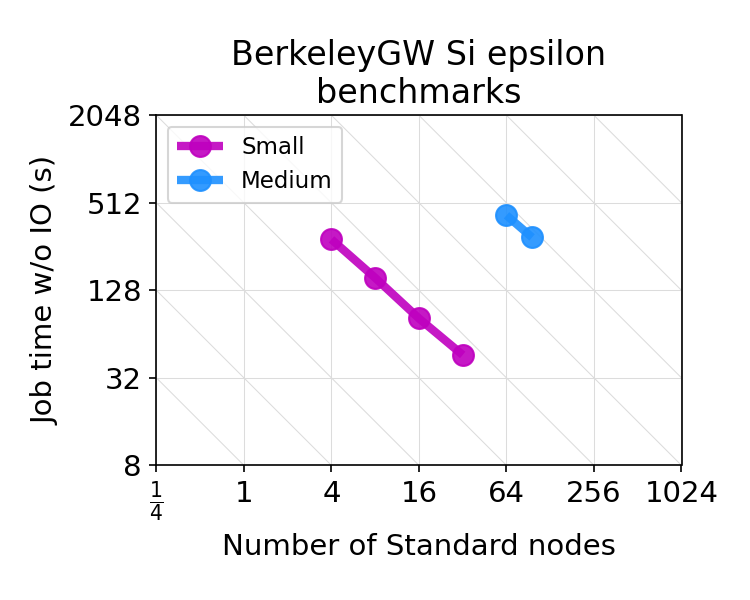
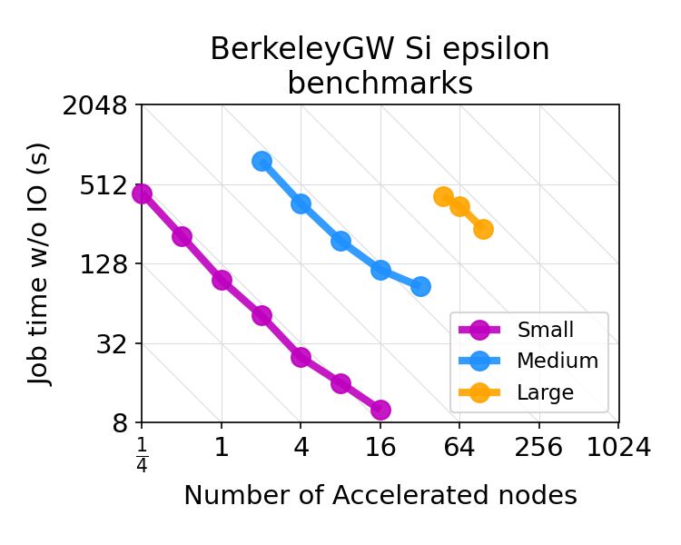

This benchmark for NLR ESIF-HPC-4 adapts the Optical Properties of Materials benchmark set from the [NERSC-10 Benchmark Suite](https://www.nersc.gov/systems/nersc-10/benchmarks). 

Any available general ESIF-HPC-4 benchmark run rules provided in the technical specifications should be reviewed before running this benchmark.

In particular:
- Any broader ESIF-HPC-4 run rules apply to this benchmark except where explicitly noted within this README.
- Responses must include the performance metrics discussed below in section 3.1. These values include whether the run successfully completed (Validation), the Total Time in seconds, the Total I/O Time in seconds, and the Benchmark Time (defined as Total Time minus Total I/O Time) in seconds. Each timing result must be taken from the "max" column of the "Wall time (s)" right columns (the final time column before "Number of calls") in the BerkeleyGW output file summary table. Each reported result's BerkeleyGW output file, `BGW_EPSILON.out`, must be provided. The reference times included for this benchmark were run by NLR on Kestrel. 
- This benchmark set defines multiple benchmark sizes: Small, Medium, and Large to allow testing across a range of resource sizes. Only the Large benchmark is required for the RFP response, however the offeror might wish to provide additional timing data for the Small/Medium benchmarks to showcase the offered system's performance at many calculation scales. The multiple benchmark sizes form a weak-scaling set, and a given benchmark size can be run with different amounts of compute resources to form a strong-scaling set. We have provided a table with strong-scaling results for each benchmark size at the end of this document to provide reference data on the performance currently achievable on Kestrel.  
- This benchmark can be run on standard or accelerated compute nodes, and is expected to perform well on both. If both CPU-only and accelerated nodes are offered, it is sufficient to return results only for the accelerated nodes, and CPU-only results may be returned optionally.

For this BerkeleyGW benchmark, we describe here how different job modifications are classified for Baseline, Ported, and Optimized results. Any change not discussed here is assumed to be addressed by the general ESIF-HPC-4 run requirements. For example, FP64 precision must be used for the Baseline and Ported reported results. 

For Baseline results, we note here the allowed changes:
1. For accelerated runs, change the `max_mem_nv_block_algo XXXX` tag in `epsilon.inp`. This can greatly impact performance by allocating more accelerator memory to an Epsilon subroutine, with more memory usually running faster. 
2. Modify any optimization flags (the "-O#" flags) in the make file.
3. Use any libraries (e.g. scalapack vs ELPA as the eigenvalue solver). The environment used to build BerkeleyGW must be provided in the response.
4. Change the number of OMP_NUM_THREADS used at runtime.
5. Change the number of MPI tasks used at runtime.
6. Change the directory striping for file I/O, as long as changes to these settings are expected to be available to general, non-privileged users on the offered machine.
7. Make any other changes, beyond those outlined here, that fall under the general "baseline" definition outlined in the technical specifications.

For Ported results, the offeror may:
1. Modify the BerkeleyGW offloading directives if it is necessary for the code to execute. BerkeleyGW uses OpenACC and OpenMP-target directives, which are known to run well on multiple types of accelerated nodes.

For Optimized results, the offeror may:
1. Modify the BerkeleyGW source code in any other way not covered by the Ported category. Any source code changes must be provided in the response.
2. Provide results using precisions other than FP64 as long as the job correctness is upheld.

# 0. Workflow Overview

Predicting optical properties of materials and nanostructures is a key step toward developing future energy conversion materials and electronic devices. The BerkeleyGW code is widely used for this type of simulation workflow. A typical workflow takes some mean field-related quantities from DFT-based codes such as PARATEC, Abinit, PARSEC, Quantum ESPRESSO, OCTOPUS, SIESTA, or JDFTx. Then BerkeleyGW's Epsilon module computes the material's dielectric function. The Sigma module uses the output of the preceding steps to compute the electronic self energy. Two other modules, Kernel and Absorption, can build upon the output from Epsilon and Sigma to calculate the electron-hole interactions and neutral optical excitation properties.

**This benchmark focuses on the Epsilon stage of the workflow. The DFT, Sigma, Kernel, and Absorption stages are not included in this benchmark.**

The BerkeleyGW code is written primarily in Fortran, with some C and C++. It is parallelized using MPI and OpenMP on the CPU, and OpenACC/OpenMP-target constructs on GPUs. The project website is [https://berkeleygw.org](https://berkeleygw.org), with accompanying [online documentation](http://manual.berkeleygw.org/4.0/). Further details describing the implementation has been published [here](https://www.sciencedirect.com/science/article/pii/S0010465511003912?via%3Dihub). BerkeleyGW is distributed under the Berkeley Software Distribution (BSD) license. Please see the `BerkeleyGW/license.txt` and `BerkeleyGW/Copyright.txt` files in the source code for more details.

## 0.1 Epsilon 

The Epsilon module for the GPP approach has three main computational kernels:
* MTXEL: Matrix elements computation
* CHI-0: Static Polarizability
* Inversion: Matrix inversion of the static polarizability (LU decomposition + triangular inversion)

The computational complexity of Epsilon is $O(N^4)$, where $N$ is the number of atoms.

## 0.2 Parallel decomposition

Epsilon uses a two-tier MPI inter- and intra-pool decomposition over electronic states to exploit the available parallelism.

# 1. BerkeleyGW Code Access and Compilation Details

The instructions below can be used to build BerkeleyGW for the GPU-accelerated nodes of NLR's Kestrel system. This example is not intended to prescribe how to build BerkeleyGW; some modifications may be needed to build BerkeleyGW for other target architectures. A download of the BerkeleyGW source code will contain a `config/` directory containing `arch.mk` files the offeror might useful for compiling on their machine. 

## 1.0 Build Environment

Before beginning, it is convenient to store the path to the directory that contains this README.md file in the `E4_BGW` environment variable:

```
E4_BGW=$(pwd)
```
AND be sure to update the `E4_BGW` variable line in `$E4_BGW/benchmarks/site_path_config.sh` to be the same path!

BerkeleyGW depends on multiple external software packages, and has been tested extensively with various configurations. BerkeleyGW might perform better due to math library optimization. Other math libraries may also be used, such as using ELPA instead of ScaLAPACK for matrix diagonalization. 

| Category | Dependency<br>Level | Tested Packages |
|---       |---                  |---                 |
| Operating system | required   | Linux, AIX, MacOS  |
| Fortran compiler | required   | pgf90, ifort, gfortran, g95, openf90, sunf90, pathf90,<br>crayftn, af90 (Absoft), nagfor, xlf90 (experimental) |
| C compiler       | required   | pgcc, icc,  gcc, opencc, pathcc, craycc, clang   |
| C++ compilers    | required   | pgCC, icpc, g++, openCC, pathCC, crayCC, clang++ |
| FFT              | required   | FFTW versions 3.3.x |
| LAPACK/BLAS      | required   | NetLib, ATLAS, Intel MKL, ACML, Cray LibSci      |
| MPI              | optional   | OpenMPI, MPICH1, MPICH2, MVAPICH2, Intel MPI     |
| ScaLAPACK/BLACS  | required if MPI is used |  NetLib, Cray LibSci, Intel MKL, AMD |
| File IO          | required   | HDF5 |

On Kestrel, the libraries used to build BerkeleyGW can be loaded by module commands:
```bash
module swap PrgEnv-gnu PrgEnv-nvhpc
module load cray-hdf5-parallel
module load cray-fftw
module load cray-libsci
module load python 
```

## 1.1 Downloading BerkeleyGW

To compile BerkeleyGW yourself, the latest code version can be downloaded from the BerkeleyGW website: [https://berkeleygw.org/download/](https://berkeleygw.org/download/) or using this [direct download link](https://app.box.com/s/22edl07muvhfnd900tnctsjjftbtcqc4). The current release (4.0 at the time of this writing) is recommended due to the many performance improvements as compared to the 3.x versions. In the directory containing `BerkeleyGW-4.0.tar.gz`, untar the BerkeleyGW source code:
```
tar -xvf BerkeleyGW-4.0.tar.gz
```
and descend into the source code directory. We will be working in this directory for sections 1.2 and 1.3 below. 

## 1.2 Configuring BerkeleyGW

The BerkeleyGW build system is based on `make` and requires manual configuration by editing an architecture-specific make file named `arch.mk`. Example `arch.mk` files for various supercomputers are provided in the source code's `config` directory.
* Select the file most closely related to the target environment and copy it to the name `arch.mk`. For example:
```bash
cp config/perlmutter.nersc.gov-nvhpc-openacc.mk arch.mk
```
* Edit the `arch.mk` file to fit your needs, for example, by adding the appropriate library paths.
Refer to the [BerkeleyGW manual](http://manual.berkeleygw.org/4.0/compilation-flags/) for more options.

## 1.3 Compiling BerkeleyGW

Stay in this directory to compile the `epsilon` BerkeleyGW module (many modules could optionally be compiled, but this benchmark only uses Epsilon). The following command will generate the complex (`cplx`) version of the code.
```
cp flavor_cplx.mk flavor.mk
make -j epsilon
```
After compilation, the executable (`epsilon.cplx.x`) will be created in the `Epsilon/` directory. Symbolic links with the same name will now be in the `bin/` directory.

# 2. Running the BerkeleyGW benchmark

The `benchmarks` directory contains three benchmark sizes:

| Benchmark Size | Atoms             |
| -------------- | ----------------- |
| small          | Si<sub> 214</sub> |
| medium         | Si<sub> 510</sub> |
| large          | Si<sub> 998</sub> |

Each benchmark simulates a silicon divacancy defect embedded in a series of progressively larger supercells. The Small, Medium, and Large benchmarks are provided to facilitate testing and profiling across a wide range of numbers of resources.

**Only benchmark runs for the Large size are required for the response.**

The offeror should return results for a strong scaling series of N, 2N, and 4N jobs, where N is the smallest number of nodes that the Large benchmark can fit on. 

## 2.1 Download wave-function data

Each benchmark requires potentially large wave-function (`XXXX.WFN`) data files that must be downloaded separately prior to running any jobs. Each benchmark size requires separate WFN files. For example, to run the Large benchmark, only the Large benchmark files need to be downloaded.

The data files should be downloaded to the `Si_WFN_folder` directory. Note that it may be possible to reduce I/O time by moving the `Si_WFN_folder` to a high performance filesystem prior to the download and distributing the directory over multiple disks (striping). Explicit striping instructions are not provided here because the commands and optimal settings are not transferable to other filesystems.

The files are currently available from the [NERSC BerkeleyGW Benchmark data portal](https://portal.nersc.gov/project/m888/nersc10/benchmark_data/BGW_input) and can be retreived using `wget`. The `wget_WFN.sh` script is provided to simplify the download process:
```
$ cd Si_WFN_folder
$ ./wget_WFN.sh --help
| Usage: wget_WFN.sh <size>
| Allowed sizes: 
|  [ small     (   3 GB ), 
|    medium    (  18 GB ), 
|    large     (  71 GB ) ]
```

## 2.2 Update site-specific files

Now, returning to the `$E4_BGW/benchmarks` directory, edit the `site_path_config.sh` script to specify the location of required libraries you built BerkeleyGW with, store the BerkeleyGW executable (`bin/`) directory as the `BGW_DIR` variable, and verify the directory names with the Si WFN I/O files for each benchmark size. In particular:
* Make sure you have set the `E4_BGW` variable as per the instructions at the start of section 1.0 above. 
* `HDF_LIBPATH=` path to the location of libraries, if any. May not be necessary if a module is loaded instead.
* `BGW_DIR=` path to epsilon.cplx.x (i.e., the `BerkeleyGW_source_code/bin/` directory created in the previous section).
* `Si_WFN_folder=` path to Large I/O downloaded files (`$Si_WFN_folder/` from the previous section).

## 2.3 Submit

Each benchmark size has its own subdirectory within `$E4_BGW/benchmarks`. Each of those directories contains the input files needed for Epsilon, and a submit script suitable for NLR's Kestrel system. For example, to run the Large size Epsilon calculation on Kestrel, after having appropriately modified `$E4_BGW/benchmarks/site_path_config.sh`, do:
```
cd $E4_BGW/benchmarks/large_Si998/
sbatch run_epsilon_Si998.sh 
```

Note that a script called `stripe_large.sh` has been included that on Kestrel allows striping of a particular directory. This script can optionally be called by each `run_epsilon_XXXX.sh` Slurm script and can be modified if alternative striping is used. The I/O performance of the Medium and Large benchmarks in particular might benefit from striping the Si wavefunction and run directories across ~24-72 OSTs on Lustre file systems, as the wavefunctions and epsilon matrix files are dozens of GB in size. 

Each Kestrel GPU node has 4 NVIDIA H100 GPUs (80 GB memory each) and dual socket AMD Genoa CPUs. The parallel configuration for all runs on Kestrel used 4 MPI tasks per node, and each MPI task used 1 GPU and 16 CPU cores. To run on systems different than Kestrel, modify the run scripts to reflect the hardware specifics of the architecture of interest. The number of MPI tasks are allowed to be adjusted to improve performance. The input file (`epsilon.inp`) may not be modified **except** to optimize `max_mem_nv_block_algo` for accelerated runs, which sets the maximum GPU memory per MPI rank (in GB) to use for Epsilon's chi summation phase. This flag can have a strong influence on time to solution: more memory typically improves performance. The Kestrel GPU results shown below were all generated using `max_mem_nv_block_algo 80`.

There are `epsilon-cpu.inp` files provided for each benchmark size that should be used for standard node runs without accelerators, which specify that different non-offloaded internal BerkeleyGW routines are used.

The `run_epsilon_XXXX.sh` scripts will generate a `BGW_EPSILON_XXXX` folder where the calculations will run, and all output files will be written to this directory. The main results, including timing information, are directed to standard output, which will be directed to `BGW_EPSILON.out`. This file will be used to determine the correctness and performance for each calculation.

# 3. Results

## 3.1 Correctness & Timing

Correctness can be verified using the `$E4_BGW/benchmarks/validate.py` script, which compares values (the `Head of Epsilon` and `Epsilon(2,2)` values) from the output to their expected output. The result of the validation test is printed on the first line of the script output. For example:
```
Usage:
  ./validate.py <size> <output_file>
Allowed sizes: small, medium, large

$ Validating epsilon job for size: small
      Tolerance: 1e-10

      Reference Head of Epsilon = 1.777506988066533e+01
      Test Head of Epsilon =      1.777506988066550e+01
      Absolute Error =            1.705302565824240e-13

      Reference Epsilon(2,2) = 9.276513200265800e+00
      Test Epsilon(2,2) =      9.276513200265793e+00
      Absolute Error =         7.105427357601002e-15

    Validation:     PASSED
    Total Time:     395.65
    I/O Time:       6.60
    Benchmark Time: 389.05
```
In addition, this script will print performance results for the job:
* Total Time corresponds to the full duration of the executed job.
* I/O Time is the time spent writing data to disk.
* Benchmark Time is computed by subtracting the I/O times from the Total Time.

## 3.2 Performance on Kestrel

The sample data in the table below are measured runtimes from NLR's Kestrel CPU and GPU partitions. We also provide a Python script in `$E4_BGW/visualization/plot-times.py` (this script reads the `$E4_BGW/visualization/results-summary.xlsx` file) that an Offeror may optionally use to plot their results and compare with NLR's baseline performance results. Sample output files for the large benchmark are also located in `$E4_BGW/benchmarks/large_Si998/NLR-results/`.

### 3.2.1 Standard (CPU) Node Performance

Kestrel has dual socket Intel Xeon Sapphire Rapids CPU nodes with 52-core processors (104 cores total) and 256 GB memory. The CPU-targeted BerkeleyGW executables were built using PrgEnv-gnu. Note that the number of OpenMP threads used (as set by `OMP_NUM_THREADS`) may substantially impact benchmark time-to-solution. The table below summarizes our current best Small and Medium benchmark results for different numbers of Kestrel CPU nodes. We have not run the Large benchmark on Kestrel's CPU nodes. 

| Node Type | Problem Size | CPU Nodes Used | Cores | Threads | Epsilon Total Time (seconds) | Epsilon I/O Time (seconds) | Epsilon Benchmark Time (seconds) |
|:---------:|:------------:|:--------------:|:-----:|:-------:|:----------------------------:|:--------------------------:|:--------------------------------:|
|    CPU    |     Small    |       4        |  416  |    1    |              289             |              2             |                287               |
|    CPU    |     Small    |       8        |  832  |    1    |              157             |              2             |                156               |
|    CPU    |     Small    |       16       |  1664 |    8    |              83              |              2             |                82                |
|    CPU    |     Small    |       32       |  3328 |    8    |              47              |              1             |                46                |
|    CPU    |    Medium    |       64       |  6656 |    8    |              422             |              3             |                420               |
|    CPU    |    Medium    |       96       |  9984 |    8    |              298             |              3             |                296               |



### 3.2.2 Accelerated (GPU) Node Performance

Kestrel's GPU nodes have one dual socket AMD Genoa CPU with 64-core processors (128 cores total) and four NVIDIA H100 SXM GPUs with 80 GB memory. Each GPU node job used four MPI tasks per node, each with one GPU and 16 cores. The GPU-accelerated BerkeleyGW executables were built using PrgEnv-nvhpc. Note that the number of OpenMP threads used (as set by `OMP_NUM_THREADS`) may substantially impact benchmark time-to-solution. For example, although most GPU benchmarks shown here run roughly optimally on Kestrel using 16 threads, the Large benchmark on 48 GPU nodes ran faster using 24 threads (see [Section 3.2.2.2](#3222-large-benchmark-gpu-performance-with-openmp-threads) below). The table below summarizes our current best Small, Medium, and Large benchmark results for different numbers of Kestrel GPU nodes. 

| Node Type | Problem Size | GPU Nodes Used | MPI Tasks | Threads | Epsilon Total Time (seconds) | Epsilon I/O Time (seconds) | Epsilon Benchmark Time (seconds) |
|:---------:|:------------:|:--------------:|:---------:|:-------:|:----------------------------:|:--------------------------:|:--------------------------------:|
|    GPU    |     Small    |      0.25      |     1     |    16   |              455             |             16             |                439               |
|    GPU    |     Small    |      0.5       |     2     |    16   |              228             |             21             |                207               |
|    GPU    |     Small    |       1        |     4     |    16   |              102             |              6             |                96                |
|    GPU    |     Small    |       2        |     8     |    16   |              56              |              3             |                52                |
|    GPU    |     Small    |       4        |     16    |    16   |              27              |              2             |                25                |
|    GPU    |     Small    |       8        |     32    |    16   |              18              |              2             |                16                |
|    GPU    |     Small    |       16       |     64    |    16   |              12              |              2             |                10                |
|    GPU    |    Medium    |       2        |     8     |    16   |              811             |             40             |                771               |
|    GPU    |    Medium    |       4        |     16    |    16   |              392             |             26             |                366               |
|    GPU    |    Medium    |       8        |     32    |    16   |              203             |             13             |                190               |
|    GPU    |    Medium    |       16       |     64    |    16   |              124             |              9             |                115               |
|    GPU    |    Medium    |       32       |    128    |    16   |              96              |             10             |                86                |
|    GPU    |     Large    |       48       |    192    |    24   |              441             |             28             |                414               |
|    GPU    |     Large    |       64       |    256    |    16   |              409             |             60             |                349               |
|    GPU    |     Large    |       96       |    384    |    16   |              296             |             61             |                235               |



#### 3.2.2.1 Medium benchmark Accelerated (GPU) Node Performance with OpenMP Threads

Next, we show Medium benchmark timing results using numbers of OpenMP threads for selected GPU node counts. We find that using fewer than 16 threads greatly reduces performance. Using more than 16 threads may or may not improve the benchmark times and may impact I/O Time and Benchmark Time differently. 

| Node Type | Problem Size | GPU Nodes Used | MPI Tasks | Threads | Epsilon Total Time (seconds) | Epsilon I/O Time (seconds) | Epsilon Benchmark Time (seconds) |
|:---------:|:------------:|:--------------:|:---------:|:-------:|:----------------------------:|:--------------------------:|:--------------------------------:|
|    GPU    |    Medium    |       4        |     16    |    1    |             1379             |             23             |               1357               |
|    GPU    |    Medium    |       4        |     16    |    4    |              610             |             46             |                564               |
|    GPU    |    Medium    |       4        |     16    |    8    |              468             |             39             |                429               |
|    GPU    |    Medium    |       4        |     16    |    16   |              392             |             26             |                366               |
|    GPU    |    Medium    |       4        |     16    |    32   |              402             |             63             |                340               |
|    GPU    |    Medium    |       16       |     64    |    16   |              124             |              9             |                115               |
|    GPU    |    Medium    |       16       |     64    |    32   |              132             |             26             |                106               |

#### 3.2.2.2 Large benchmark Accelerated (GPU) Node Performance with OpenMP Threads

For the Large benchmark, we find that 48 nodes runs faster with 24 threads than 16 threads. The 64 and 96 node jobs' Benchmark Times were not as impacted by using 16 or 32 threads. 

| Node Type | Problem Size | GPU Nodes Used | MPI Tasks | Threads | Epsilon Total Time (seconds) | Epsilon I/O Time (seconds) | Epsilon Benchmark Time (seconds) |
|:---------:|:------------:|:--------------:|:---------:|:-------:|:----------------------------:|:--------------------------:|:--------------------------------:|
|    GPU    |     Large    |       48       |    192    |    8    |              542             |             45             |                497               |
|    GPU    |     Large    |       48       |    192    |    16   |              546             |             65             |                481               |
|    GPU    |     Large    |       48       |    192    |    24   |              441             |             28             |                414               |
|    GPU    |     Large    |       48       |    192    |    32   |              471             |             48             |                423               |
|    GPU    |     Large    |       48       |    192    |    48   |              542             |             30             |                512               |
|    GPU    |     Large    |       64       |    256    |    16   |              409             |             60             |                349               |
|    GPU    |     Large    |       64       |    256    |    32   |              384             |             35             |                349               |
|    GPU    |     Large    |       96       |    384    |    16   |              296             |             61             |                235               |
|    GPU    |     Large    |       96       |    384    |    32   |              353             |             115            |                237               |


## 3.3 Reporting

Benchmark results provided in the reporting spreadsheet should include the (Max) Total Benchmark Time, (Max) Total I/O Time, and the Benchmark Time (the difference between the first two times), all in seconds. The hardware configuration (i.e. the number of elements from each pool of computational resources) needed to achieve the estimated timings must also be provided. If both CPU-only and accelerated nodes are offered, it is sufficient to return results only for the accelerated nodes, and CPU-only results may be returned optionally. As part of the file response, include all the build environment, source, and make files used to build on the target platform, input files and run scripts, and the primary BerkeleyGW summary output file `BGW_EPSILON.out` (i.e. the one that actually contains the timing data and epsilon inverse Head value). Do not return the `eps0mat.h5` file.

